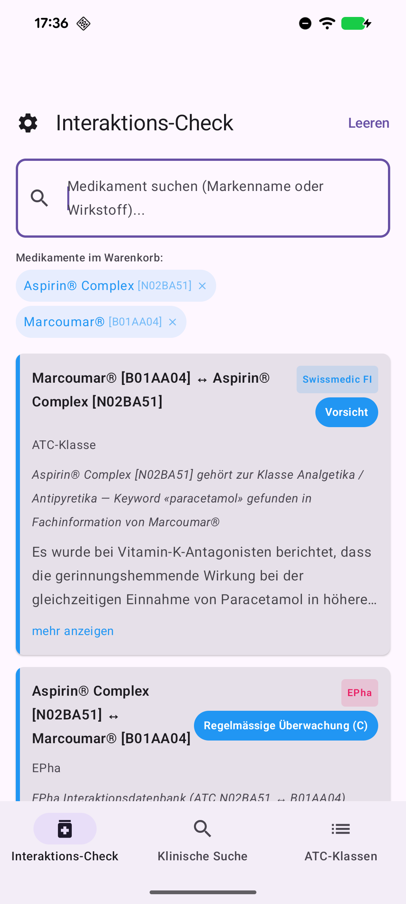
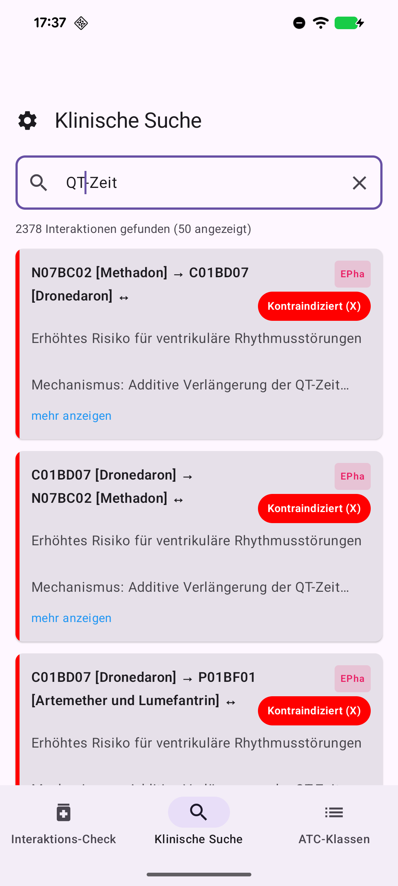

# SDIF Android

**Swiss Drug Interaction Finder** — Android app for checking drug interactions using Swiss pharmaceutical data.

## Features

- **Interaktions-Check**: Search drugs by brand name or substance, add to basket, and check interactions between them using 4 detection strategies (substance match, ATC class-level, CYP enzyme, EPha curated)
- **Klinische Suche**: Full-text clinical search with term suggestions and paginated results
- **ATC-Klassen**: Sortable overview table of ATC drug class interactions

## Tech Stack

- Kotlin + Jetpack Compose + Material 3
- SQLite database (downloaded from pillbox.oddb.org)
- Firebase Crashlytics for crash reporting
- Min SDK 26 (Android 8.0), Target SDK 35

## Build

```bash
./gradlew assembleDebug
./gradlew installDebug
```

## Database

On first launch, the app automatically downloads the SQLite database (~53MB) from `http://pillbox.oddb.org/interactions.db` with a progress indicator. The database can be updated later from within the app via Settings. No database is bundled in the APK.

## Screenshots

<p float="left">
  
  
</p>

## Google Play Store

Upload release bundle to Google Play:

```bash
./apkup_bundle
```

## License

GPLv3 — see [LICENSE](LICENSE)
